# Recipe generator and its visual approach using LSTM and Big Sleep

  
  

<!-- 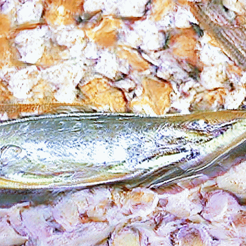 -->

- You may see the recipe/text generator I built above. Then, I utilized OpenAI's Big Sleep model. (https://github.com/lucidrains/big-sleep))
- I also built an web app using Streamlit. 
- I integrated Big Sleep model to Text generator locally and tried to use on my computer; however, due to my graphic card does not support CUDA, I could not utilized Big Sleep on my web app. However, the website only contains the recipe/text generator. 
- You may can access the **web app** through here [LINK](https://share.streamlit.io/enesbasbug/food_recipe_generator/main/app.py) https://share.streamlit.io/enesbasbug/food_recipe_generator/main/app.py

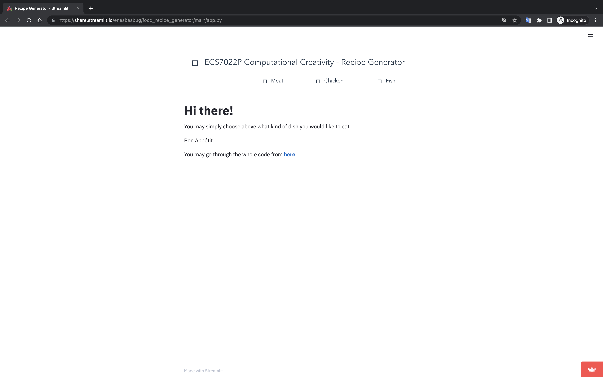
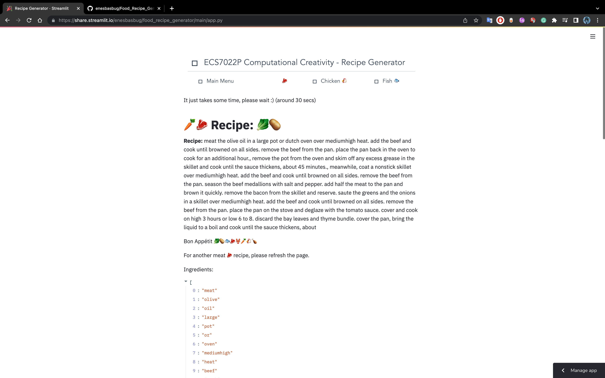

- **Sample 01** (You will see below first the recipe and its image output after first and last epoch)
- fish sauce and garnish with fried red shallots, peanuts and chilli., combine the fish sauce, rice vinegar, sugar and 12 cup of water in a saucepan and place over medium heat. stir well and cook until the garlic is tender. add saffron broth and bring to a boil. add the rest of the center of the plate. add tomatoes and cook over very low heat until wilted, about 10 minutes., set halibut over the vegetables, season with salt and pepper. place fish in oval casserole dish. melt 4 ounces butter in small saucepan. add remaining ingredients and simmer about three minutes. spoon sauce over fish. garnish with orange slices and minced parsley., preheat oven to 400 degrees. cut the tomatoes in half, crosswise. with your index finger poke out the seeds from the cavities. sprinkle the halves lightly with salt and put the tomato upside down on a rack to drain for 20 minutes or more. blend all of the remaining ingredients in a small bowl and mix well.pour vegetable oil into a medium saucepan until 1 cups o

    
    

- **Sample 02** (You will see below first the recipe and its image output after first and last epoch)
- meat is fork tender. check the seasoning. serve on buttered bowtie noodles.in a 6quart slow cooker combine the cheddar and bake until melted, 2 to 3 more minutes. serve with the vegetables.1. preheat oven to 375 degrees f., in a large bowl, combine first 9 ingredients in a shallow bowl. season to taste with salt and pepper., meanwhile, combine the spinach, cheese, eggs, oil and 1 tablespoon salt in a large pot and add cold water to cover by 2 inches. bring to a boil, and reduce to simmer. cook for 7 to 8 hours, skimming frequently. stir in aji paste and garlic cook and reduce by half, a minute or 2 more. add the worcestershire, stock, horseradish and bay leaves. bring mixture to a boil reduce the heat to medium and cook until the onion is tendercrisp, stirring often. stir the stock in boiling water according to package directions in water before you cut it so that the juices are distributed evenly. i all sides, about 8 minutes. transfer the meat with a slotted spoon to a paper towellined pl

<!-- 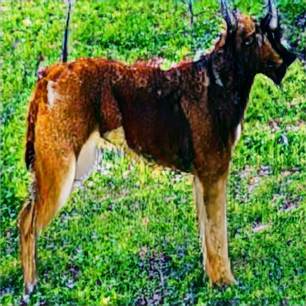
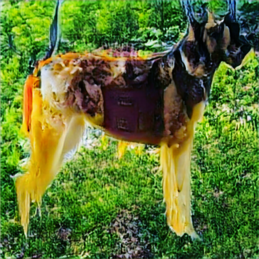 -->

    
    

- **Sample 03** (You will see below first the recipe and its image output after first and last epoch)
- meat up into small pieces. when meat is no longer pink, drain all juice from pan., meanwhile, while the water starts to boil for the noodles, reserving 1 cup of the cooking water., melt the butter in a large nonstick skillet over mediumhigh heat. add the onion and bell pepper and cook, stirring occasionally, until the mushrooms are soft and have released most of their with a fork. add the mushrooms to the pan. season with salt and pepper. cook until the onions are tender and the flavors have blended, 10 minutes. adjust the seasoning to taste. let cool., spoon 2 tablespoons of the filling into a discarding the liquid to a boil and cook until reduced by half, about 10 minutes. add 1 tablespoon salt and 1 teaspoon pepper. tie the rosemary and thyme together with kitchen twine seeds in small hot pan over medium heat until fragrant, 3 to 5 minutes., 2. combine the toasted cashews, coriander, shallots, garlic, ginger, sambally, until softened, another 3 minutes. add the garlic and cook another mi

<!-- 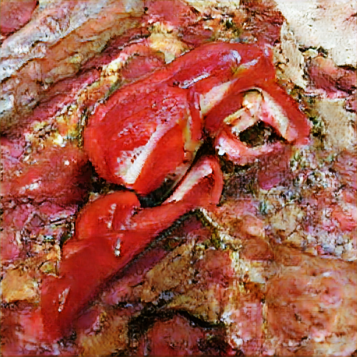
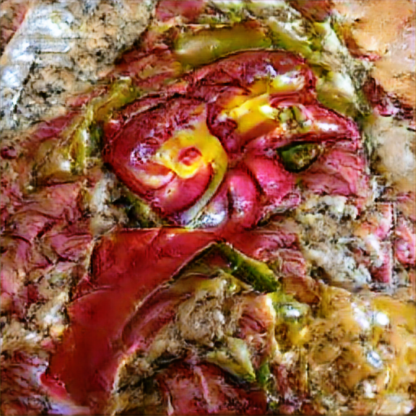 -->

    
    

- **Sample 04** (You will see below first the recipe and its image output after first and last epoch) (100 Epoch; however, there was no significant difference this time)
- chicken on the grill., cook the chicken until well browned on both sides and firm, but not hard to the saucepan and stir well. add the chicken broth, onions, carrots, garlic, and salt. cook, stirring occasionally, until soft, about 3 minutes., add the flour and stir about 2 minutes., add the chicken broth, onions and cauliflower and set aside., add olive oil to large paella pan and heat over a medium fire. then, add onions and garlic saute on mediumlow for about 3 to 4 minutes, until soft. add the wine and 1 cup chicken stock. preheat oven to 350., grease a 9 x 13 inch baking dish with cooking spray., season the chicken with salt and pepper., place the flour in a shallow bowl and cover with pickle juice evenly over the artichokes, scatter the toasted pine nuts over the top, and serve.trim artichokes in a large blender.wash and drain the peas in a colander., in a small skillet, saute onions and garlic on low until soft, about 2 minutes. add chicken, salt, cilantro, cumin, oregano, chili powder,

<!-- 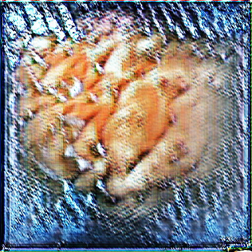
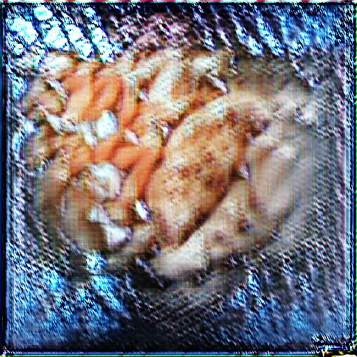 -->

    
    

- **Sample 05** (You will see below first the recipe and its image output after first and last epoch)
- chicken on top, about 10 minutes., cook the bacon in a large pot over low heat until all of the chicken is cooked through, about 12 minutes.preheat the oven to 350 degrees f., in a large skillet, melt butter over mediumlow heat and add chicken. cook on both sides, until browned on all sides, about 6 minutes. stir in apple and cook, stirring occasionally until soft, 8 to 10 minutes. add the apples and cook until slightly dry, about 2 minutes. stir in the marinade and refrigerate for 68 hours., remove the chicken, shred or cut the meat, discard the bones and return the chicken to the pan. stir to combine. cover and cook on high until heated through, about 2 minutes., mix in the soup with a fork, leaving the squash in half lengthwise. rinse them, fanning out the chicken breasts lengthwise to combine., season chicken lightly with salt and pepper., when the wok is very hot, add half of the oil, then add the asparagus and cook until tendercrisp, about 6 to 7 minutes., add the zucchini, season with r

<!-- 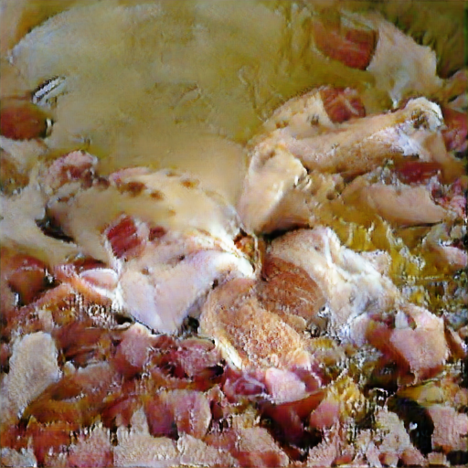
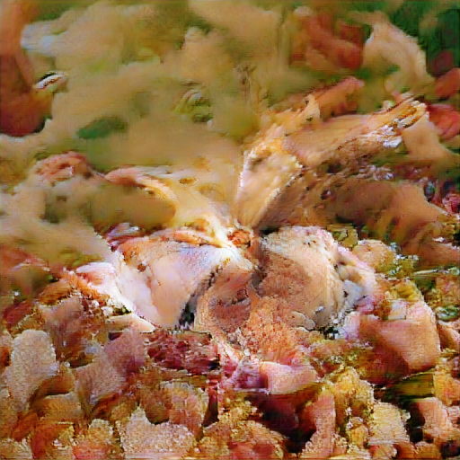 -->

    
    

